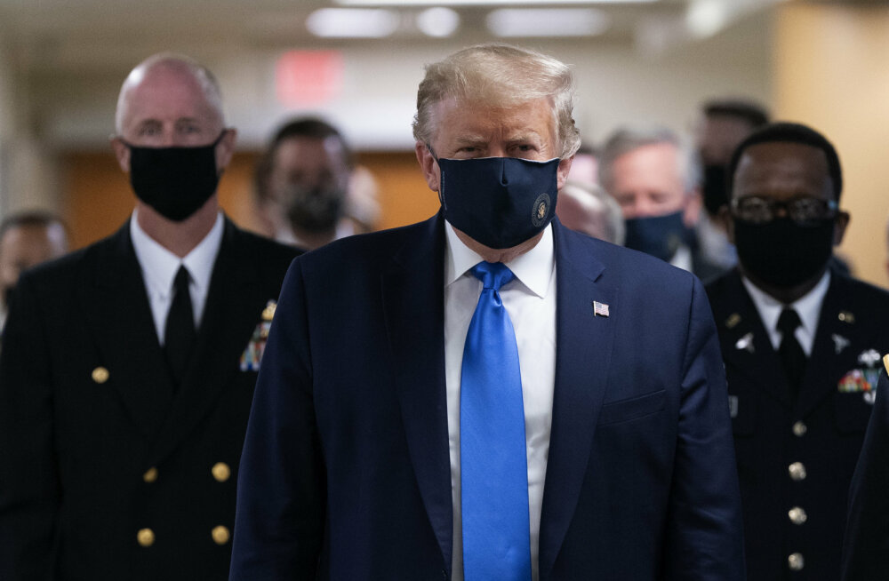

Президент США **Дональд Трамп** при посещении Национального военно-медицинского центра в пригороде Вашингтона впервые после начала пандемии коронавируса надел защитную медицинскую маску, обратили внимание мировые СМИ. 

<!--more-->  

  

"*Я думаю, что когда вы находитесь в больнице, особенно в этой конкретной обстановке, когда вы разговариваете с большим количеством солдат, людей, которые в некоторых случаях только что были на операционном столе, считаю, что это отличная вещь — надевать маску*", — сказал Трамп журналистам.  

Ранее президент отказывался носить маску на публике, не принуждая к этому других. По его словам, это — личный выбор каждого человека. В то же время, он говорил, что будет пользоваться маской в условиях, когда вокруг будет много людей и соблюдать определенную дистанцию будет невозможно.  

[Источник](https://rus.delfi.ee/daily/abroad/tramp-vpervye-poyavilsya-na-publike-v-zaschitnoj-maske?id=90425915)  

